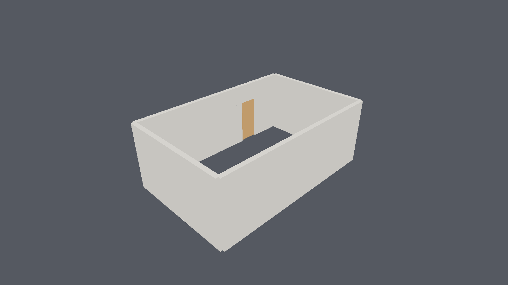
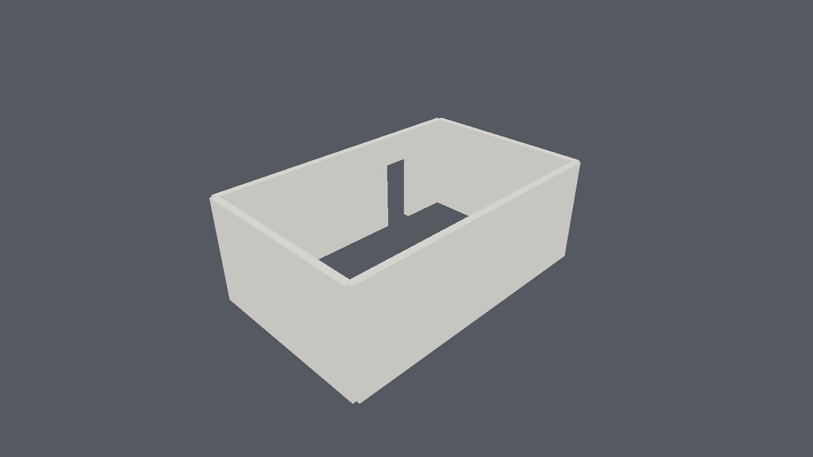

<div align="center">


# CADForge

**An IFC-native BIM authoring engine in Rust — with a real family system.**

*The engine, not yet the application: libraries, a demo pipeline, and no GUI.*

[](https://github.com/ibuilder/CADForge/actions/workflows/ci.yml)
[](LICENSE)
[](https://www.rust-lang.org)
[](tools/validate_ifc.py)

Tested on Windows, macOS, and Linux. Android and iOS are targets, not yet run on a device.

[Website](https://ibuilder.github.io/CADForge/) ·
[API docs](https://ibuilder.github.io/CADForge/api/) ·
[Roadmap](ROADMAP.md) ·
[Build plan](docs/PLAN.md) ·
[Decisions](docs/adr/) ·
[Changelog](CHANGELOG.md)

</div>

---

> [!WARNING]
> **Early development — not production ready.** Four of eight phases are complete. CADForge
> reads and writes IFC, authors a building semantically, flexes parametric families, cuts
> openings, and renders on the GPU. It has **no window** and **no authoring tools**. Every
> claim below is measured; everything unbuilt is named in [ROADMAP.md](ROADMAP.md).

## Why this exists

Every serious new BIM authoring tool in 2026 — Motif, Arcol, Qonic, Snaptrude, Forma — is
cloud/browser-first and closed. Every open one is desktop-only. Nobody ships a native,
offline-capable, openBIM authoring app that runs on a tablet as well as a workstation, and
**nothing in the open AEC ecosystem has a family system at all**.

Shapr3D proved the native-plus-tablet posture works commercially in mechanical CAD. Nobody has
done it for AEC. That is the gap, and the reasoning is documented in
[docs/research/LANDSCAPE.md](docs/research/LANDSCAPE.md) with dated sources.

## It draws

| Walls and a hosted door | The same frame, door hidden |
|---|---|
|  |  |

The doorway is invisible in the first frame because the leaf fills its own opening to within
the 10 mm frame clearance — correct, but it proves nothing. Hide the door and the boolean cut
has to be there.

## Quick start

```bash
cargo test --workspace
```

```bash
cargo run -p cadforge-shell --features gpu
```

Open an IFC file in a window:

```bash
cargo run -p cadforge-shell --features viewport --bin cadforge-viewport -- model.ifc
```

The demo drives the whole stack: it authors four walls through commands, defines a parametric
door family, places it as a hosted opening (a real `IfcOpeningElement` + `IfcRelVoidsElement` +
`IfcRelFillsElement`), cuts the wall, builds render fragments, frames a camera, culls, resolves
a simulated GPU pick back to a `GlobalId`, renders to `out/demo.png`, exports valid IFC4, then
undoes all 19 commands to an empty model and redoes them.

Validate the export against the reference implementation:

```bash
pip install ifcopenshell && python tools/validate_ifc.py out/demo.ifc
```

## What works, and what does not

| | Status |
|---|---|
| Semantic core — elements, commands with exact inverses, revisions, undo/redo, R-tree index | ✅ |
| Geometry — profiles, ear-clipping triangulation, sweeps, tolerance-driven tessellation | ✅ |
| Booleans — BSP mesh CSG, so openings actually cut their hosts | ✅ |
| Families — typed parameters, named types, recipe DAG, hosting, IFC type mapping | ✅ |
| IFC **export** — native IFC4 writer, byte-reproducible, externally validated | ✅ |
| Rendering — headless wgpu on real hardware, depth, culling, PNG output | ✅ |
| IFC **import** — reads IFC4/IFC4X3, rebuilds relationships, keeps geometry as authored | ✅ |
| A window — `winit` + `wgpu`, orbit/pan/zoom, opens `.ifc` files | ✅ |
| GPU picking — click an element, get its `GlobalId` | ✅ |
| Section planes, instancing | ❌ Phase 3b |
| iOS / Android on a device | ❌ Compiled for, never run |
| Authoring tools, snapping, constraints | ❌ Phase 5 |

## Verified, not asserted

- **179 tests** (186 with `--features gpu`), zero clippy warnings, `cargo fmt` clean.
- Exported IFC4 checked against **IfcOpenShell 0.8.5**: no schema or EXPRESS rule violations,
  every relationship resolves, geometry generates for every element from the swept solids
  alone, every `GlobalId` survives a round trip.
- The viewer and the exported file agree on wall volume to the cubic centimetre — **15.21 m³**
  on both sides, with IfcOpenShell independently applying the door void.
- The GPU path runs on real hardware: AMD Radeon via Vulkan.
- `ifc-lite-core` measured at **520 MB/s** over a 17.5 MB file, recovering the full parametric
  recipe — profile points and extrusion depth, not triangles.
- **All 23 of buildingSMART's certification models** import — 984 elements, one geometry
  failure, zero dangling references — and **all 23 survive import → export → import with every
  element intact**. Files CADForge did not write, including IFC4X3.

## Architecture

```text
crates/
  cadforge-core     semantic authority — elements, GlobalId, commands, revisions, undo
  cadforge-geom     profiles, sweeps, tessellation, BSP booleans — pure Rust, no C++
  cadforge-family   parametric families — params, types, recipe DAG, hosting  ← the differentiator
  cadforge-ifc      trait IfcBackend + a native IFC4 STEP writer
  cadforge-render   fragments, camera, culling + a headless wgpu renderer (feature `gpu`)
  cadforge-shell    platform entry points; today a demo pipeline, Phase 3b makes it winit+wgpu
```

Four boundaries the codebase enforces:

1. **Every mutation is a `ModelCommand`, and every command has an exact inverse.** Nothing else
   touches the store. That single rule is what buys undo, audit, replay, and eventual
   multi-user sync rather than retrofitting them.
2. **`cadforge-core` has no platform and no IFC-library dependencies.** `cargo test -p
   cadforge-core` passes on a headless machine with no GPU.
3. **No third-party IFC type reaches the core.** The library is swappable because nothing knows
   which one is in use.
4. **The renderer never owns truth.** Delete every fragment and the model is intact.

## The decisions that shape it

Nine [ADRs](docs/adr/) carry the evidence, the costs, and what would make each wrong. The three
that matter most:

**[No webview for the viewport](docs/adr/0001-native-shell-over-webview.md).** WebGPU is absent
from WKWebView (macOS *and* iOS) and Android System WebView. A webview viewport would be capped
at WebGL2 on three of four target platforms — on current hardware. The viewport is a native
wgpu surface. [ADR-0002](docs/adr/0002-shell-boundary-keeps-tauri-possible.md) keeps a Tauri
shell one crate away should that change.

**[No B-rep kernel](docs/adr/0004-no-brep-kernel.md).** There is no production-grade pure-Rust
one in 2026 — Fornjot ended without reaching its goals, `truck`'s crates.io releases are two
years stale, `opencascade-rs` needs a C++ toolchain that will not ship to mobile. Geometry is a
deterministic parametric recipe; the mesh is a disposable cache. Walls, slabs, columns, beams,
openings, ducts, and pipes are all profile sweeps.

**[The family system is the product](docs/adr/0005-family-system-is-the-differentiator.md).**
And its ingest limits are stated up front: `.rfa` yields parameters and types, **never
parametric geometry** — Revit's geometry and constraint solver are closed and have not been
reverse-engineered. Geometry comes from Revit's IFC export.

## Documentation

| Document | What it is |
|---|---|
| [ROADMAP.md](ROADMAP.md) | Where this is going, and what would change the plan |
| [docs/PLAN.md](docs/PLAN.md) | The full build plan — architecture, phases, risks |
| [docs/research/LANDSCAPE.md](docs/research/LANDSCAPE.md) | Dated evidence behind every decision, with sources |
| [docs/ifc-semantics.md](docs/ifc-semantics.md) | The IFC mapping reference — entities, relationships, fallback rules |
| [docs/adr/](docs/adr/) | Architecture decision records |
| [API documentation](https://ibuilder.github.io/CADForge/api/) | rustdoc for every crate, rebuilt on each push |
| [CHANGELOG.md](CHANGELOG.md) | What changed, and what is knowingly missing |

## Contributing

See [CONTRIBUTING.md](CONTRIBUTING.md). For anything larger than a bug fix, open an issue
first — it is cheaper to disagree about an approach in an issue than in a pull request.

One thing worth internalising before you start: **when a test fails here, check the test before
you change the code.** Two of the more useful findings in this repo came from tests whose
premise was wrong.

## License

[MPL-2.0](LICENSE). File-level copyleft: modifications to existing files stay open, but the
license does not reach into code that merely links against it. That combination is deliberate —
it keeps the openBIM core open while letting people build proprietary tools on top.

Not affiliated with buildingSMART, Autodesk, or Graphisoft. IFC is a buildingSMART standard.
